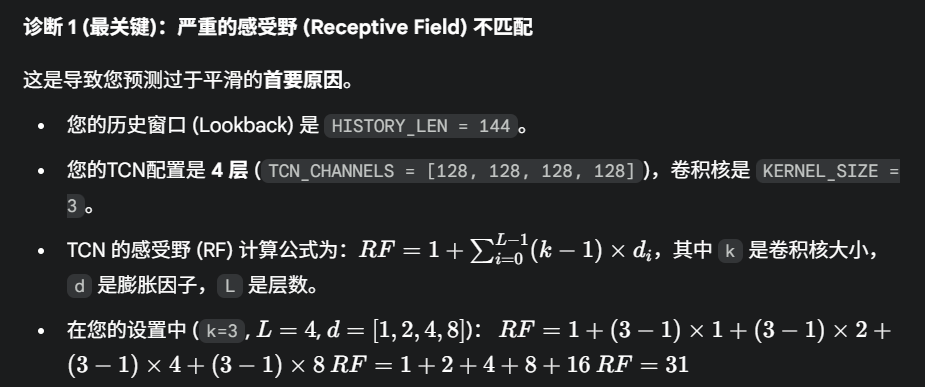

1.
    11.06开始我经过考证，发现我的TCN模型存在两个大隐患：
    （1）严重的感受野 (Receptive Field) 不匹配
        
        为此我先尝试修改增加层数(4->7)，看看效果如何：验证MAPE从14.84%下降到了14.25%
        （train_result_tcn1->train_result_tcn2）
        具体数据为：Epoch 4/50 - Train Loss: 0.0041 (Log-Space), Val Loss: 0.0098 (Log-Space), Val MAPE: 14.84% (Original-Space)
                ✨ 新的最佳 TCN 模型 (MAPE: 14.84%) 已保存!
                ->
                Epoch 22/50 - Train Loss: 0.0034 (Log-Space), Val Loss: 0.0087 (Log-Space), Val MAPE: 14.25% (Original-Space)
                ✨ 新的最佳 TCN 模型 (MAPE: 14.25%) 已保存!

   (2)"Seq2One" 预测策略的信息瓶颈:
        我的TCN架构采用的是一种“编码器-解码器”策略：
        编码 (TCN)：将 (Batch, 144, Features) 的序列压缩。
        压缩：我只取了TCN输出的最后一个时间步 tcn_out[:, :, -1]。
        解码 (MLP)：将这个时间步的向量（batch, channels_out）送入一个MLP，以一次性预测未来 6 个步长（PRED_LEN = 6）。
        这个策略（尤其是 tcn_out[:, :, -1]）制造了一个巨大的信息瓶颈。我要求模型将 144 个时间步的所有动态信息，压缩到 一个 时间步的向量中，然后再用这个向量“猜”出未来 6 步的完整序列。这非常困难，模型为了最小化损失，会选择“放弃”高频的尖峰，只预测最安全的平滑平均值。
        改进：
            当前 (Seq2One)：TCN(144) -> Vector(1) -> MLP -> Pred(6) 建议 (Seq2Seq)：TCN(144) -> Sequence(144) -> 1x1Conv -> Sequence(144) -> Take Last -> Pred(6)
            这个架构强迫 TCN 在每一步都输出一个对未来的预测，这提供了更强的监督信号，并使 TCN 专注于其卷积特性，而不是充当编码器。
            # 1. 移除 'output_layers' 中的大型 MLP
            # self.output_layers = nn.Sequential(
            #     nn.Linear(self.last_channel_size, 128),
            #     nn.ReLU(),
            #     nn.Dropout(dropout),
            #     nn.Linear(128, pred_len * num_stations)
            # )
            # 2. 替换为一个 1x1 卷积层
            self.output_conv = nn.Conv1d(
                self.last_channel_size,  # TCN 最后一层的通道数
                pred_len * num_stations, # 目标输出通道数
                kernel_size=1
            )
            def forward(self, traffic_x, time_x):
                # ... (步骤 1-3 保持不变) ...
                x = x.permute(0, 2, 1)  # (batch, channels_in, seq_len)
                # 4. 通过 TCN 网络
                tcn_out = self.tcn_network(x)  # (batch, channels_out, seq_len)
                # 5. [!!! 关键修改 !!!]
                #    不再只取最后一步，而是将整个序列送入 1x1 卷积
                pred_seq = self.output_conv(tcn_out) # (batch, pred_len * num_stations, seq_len)
                # 6. [!!! 关键修改 !!!]
                #    现在，我们只取这个新序列的最后一个时间步
                pred = pred_seq[:, :, -1] # (batch, pred_len * num_stations)
                # 7. 重塑形状以匹配 y (target)
                pred = pred.view(-1, self.pred_len, self.num_stations)  # (batch, pred_len, num_stations)
                return pred
                这种 Seq2Seq 架构通常比 Seq2One（编码器-解码器）架构更稳定，对峰值的捕捉能力更强。
        模型性能提升：
            验证MAPE从14.25%下降到了12.85%
            （train_result_tcn2->train_result_tcn3）模型3
            具体数据：
                Epoch 22/50 - Train Loss: 0.0034 (Log-Space), Val Loss: 0.0087 (Log-Space), Val MAPE: 14.25% (Original-Space)
                ✨ 新的最佳 TCN 模型 (MAPE: 14.25%) 已保存!
                ->
                Epoch 23/50 - Train Loss: 0.0018 (Log-Space), Val Loss: 0.0070 (Log-Space), Val MAPE: 12.85% (Original-Space)
                ✨ 新的最佳 TCN 模型 (MAPE: 12.85%) 已保存!
   2.
       11.7:上面是对模型框架的优化，现在进行超参调优和特征工程阶段：
           （1）卷积核大小 (Kernel Size)这是 TCN 中第二重要的超参数（仅次于感受野）。它决定了模型一次“看”多宽的局部模式。
                k=3 是一个非常“中庸”的选择。 对于尖峰（Spike）数据（如交通流量）：一个稍大的卷积核 (如 k=5 或 k=7) 可能表现更好，因为它可以在一层中就捕捉到“峰值上升-达到顶峰-峰值下降”的完整模式。
                改进：k=3 -> k=5
                具体数据：(验证MAPE从14.25% -> 11.68%)
                （train_result_tcn3->train_result_tcn4）模型4
                Epoch 22/50 - Train Loss: 0.0034 (Log-Space), Val Loss: 0.0087 (Log-Space), Val MAPE: 14.25% (Original-Space)
                ✨ 新的最佳 TCN 模型 (MAPE: 14.25%) 已保存!
                ->
                Epoch 23/50 - Train Loss: 0.0017 (Log-Space), Val Loss: 0.0061 (Log-Space), Val MAPE: 11.68% (Original-Space)
                ✨ 新的最佳 TCN 模型 (MAPE: 11.68%) 已保存!